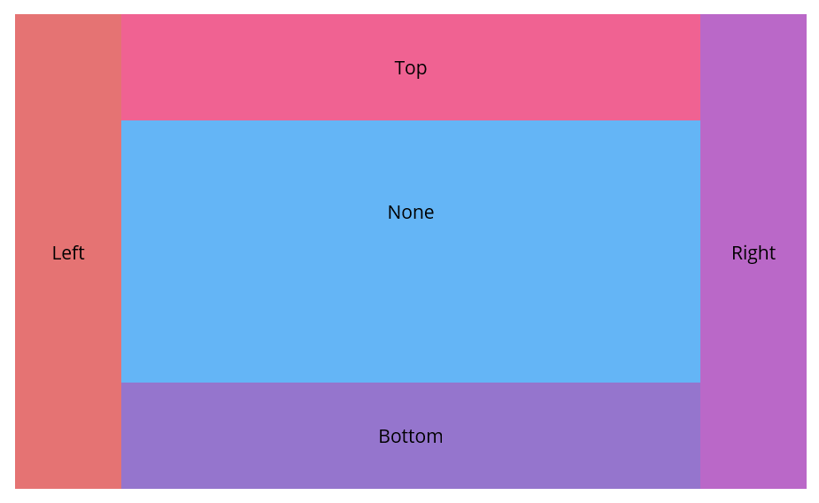

# Getting started with Syncfusion .NET MAUI DockLayout control
## Creating an application with .NET MAUI chart
1.Create a new .NET MAUI application in Visual Studio.
2.Syncfusion .NET MAUI components are available in [nuget.org.](https://www.nuget.org/)
3.To add SfDockLayout to your project, open the NuGet package manager in Visual Studio, search for Syncfusion.Maui.Core and then install it.
Initialize [SfDockLayout.]()

###### Xaml
```xaml
<ContentPage
    . . .    
    xmlns:dx="clr-namespace:Syncfusion.Maui.Core;
    assembly=Syncfusion.Maui.Core">
   
     <dx:SfDockLayout/>

</ContentPage>
```
###### C#
```C#
using Syncfusion.Maui.Core;
namespace DockLayoutGettingStarted
{
    public partial class MainPage : ContentPage
    {
        public MainPage()
        {
            InitializeComponent();  
            SfDockLayout dockLayout = new SfDockLayout();
            Content = dockLayout;       
        }
    }   
}
```

## Register the handler
Syncfusion.Maui.Core nuget is a dependent package for all Syncfusion controls of .NET MAUI. In the MauiProgram.cs file, register the handler for Syncfusion core.

###### C#
```C#
using Microsoft.Maui;
using Microsoft.Maui.Hosting;
using Microsoft.Maui.Controls.Compatibility;
using Microsoft.Maui.Controls.Hosting;
using Microsoft.Maui.Controls.Xaml;
using Syncfusion.Maui.Core.Hosting;

namespace DockLayoutSample
{
  public static class MauiProgram
  {
	public static MauiApp CreateMauiApp()
	{
		var builder = MauiApp.CreateBuilder();
		builder
		.UseMauiApp<App>()
		`.ConfigureSyncfusionCore()`
		.ConfigureFonts(fonts =>
		{
			fonts.AddFont("OpenSans-Regular.ttf", "OpenSansRegular");
		});

		return builder.Build();
	 }
  }
}     
```

### Set Dock Position for Child Views
Inside the [SfDockLayout]() control, child views can be arranged using the [Dock]() attached property. This property allows to dock elements to specific edges— `Top`, `Bottom`, `Left`, `Right`, or set to `None` to remain undocked and fill the remaining space.


###### Xaml
```xaml
<ContentPage xmlns="http://schemas.microsoft.com/dotnet/2021/maui"
             xmlns:x="http://schemas.microsoft.com/winfx/2009/xaml"
             xmlns:dx="clr-namespace:Syncfusion.Maui.Core;assembly=Syncfusion.Maui.Core"
             x:Class="DockLayoutGettingStarted.MainPage">

   <ContentPage.Content>
        <dx:SfDockLayout >
             <Label Text="Left"  WidthRequest="80" dx:SfDockLayout.Dock="Left" Background="#E57373" />
            <Label Text="Top" HeightRequest="80" dx:SfDockLayout.Dock="Top" Background="#F06292" />
            <Label Text="Right"  WidthRequest="80"  dx:SfDockLayout.Dock="Right" Background="#BA68C8" />
            <Label Text="Bottom" HeightRequest="80"  dx:SfDockLayout.Dock="Bottom" 
            Background="#9575CD"/>
            <Label Text="None" dx:SfDockLayout.Dock="Top" MinimumHeightRequest="80" BackgroundColor="#64B5F6" />
        </dx:SfDockLayout>
    </ContentPage.Content>
    
</ContentPage>
```

###### C#
```C#
using Syncfusion.Maui.Core;

namespace DockLayoutGettingStarted
{
    public partial class MainPage : ContentPage
    {
        public MainPage()
        {
            InitializeComponent();
            SfDockLayout dockLayout = new SfDockLayout();
            dockLayout.Children.Add(new Label() { Text = "Left", WidthRequest = 80, Background = Color.FromArgb("#E57373") }, Dock.Left);
            dockLayout.Children.Add(new Label() { Text = "Top", HeightRequest = 80, Background = Color.FromArgb("#F06292") }, Dock.Top);
            dockLayout.Children.Add(new Label() { Text = "Right", WidthRequest = 80, Background = Color.FromArgb("#BA68C8") }, Dock.Right);
            dockLayout.Children.Add(new Label() { Text = "Bottom", HeightRequest = 80, Background = Color.FromArgb("#9575CD") }, Dock.Bottom);
            dockLayout.Children.Add(new Label() { Text = "None", Background = Color.FromArgb("#64B5F6") });
            Content = dockLayout;   
        }
    }
}
```

